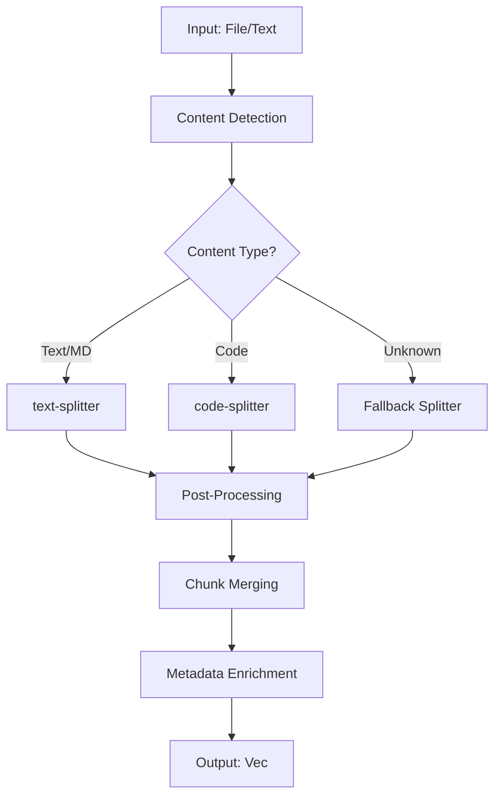

# Phase 5.3: Hybrid Chunking Pipeline

**Status:** 🚧 In Progress  
**Date:** 2025-11-20  
**Dependencies:** Phase 5.2 (LanceDB integration)

## Overview

Phase 5.3 replaces the naive character-based chunking with a **hybrid semantic chunking pipeline** that intelligently handles different content types using specialized splitters.

## Current Problems

**Existing Implementation (`chunker.rs`):**
```rust
// PROBLEMS:
// 1. Character-based splitting breaks UTF-8 boundaries (panic on "ã")
// 2. No semantic awareness (splits mid-sentence, mid-paragraph)
// 3. No code structure preservation (breaks functions/classes)
// 4. No content type detection (treats all files as plain text)
// 5. Minimal metadata (only start/end positions)
// 6. No language awareness
// 7. Fixed chunk_size without token counting
```

**Observed Issues:**
- Panic: `byte index 4480 is not a char boundary; it is inside 'ã'`
- Poor retrieval quality due to semantic breaks
- Code chunks lose context (incomplete function definitions)
- No differentiation between markdown, code, HTML, PDF-converted text

## Hybrid Chunking Architecture

### Component Stack



### Libraries

1. **text-splitter** (`text-splitter` crate)
   - High-quality semantic text splitting
   - Paragraph-aware, sentence-aware boundaries
   - Configurable chunk size with token counting
   - Supports overlap for context preservation
   - Use for: Text, Markdown, HTML-converted, PDF-converted

2. **code-splitter** (`tree-sitter` based)
   - Semantic code chunking using tree-sitter parsers
   - Preserves functions, classes, modules, structs
   - Language-aware (Rust, TypeScript, JavaScript, Python, Go, etc.)
   - Use for: Source code files

3. **Fallback Strategy**
   - Unicode-aware splitting with grapheme clusters
   - Respects word boundaries
   - Fallback for unsupported formats

### Detection Logic

```rust
enum ContentType {
    Text,           // Plain text, .txt
    Markdown,       // .md, .markdown
    Code(Language), // .rs, .ts, .js, .py, .go
    Html,           // .html, .htm
    Pdf,            // PDF-converted text
    Unknown,        // Fallback
}

enum Language {
    Rust,
    TypeScript,
    JavaScript,
    Python,
    Go,
    Unknown,
}
```

**Detection Flow:**
1. Check file extension
2. Check MIME type (if available)
3. Heuristic analysis (shebang, syntax patterns)
4. Default to Unknown → Fallback splitter

### Chunk Structure

```rust
pub struct Chunk {
    pub id: String,              // UUID v4
    pub source_id: String,       // Original file/source ID
    pub position: u32,           // Chunk index in document
    pub text: String,            // Chunk content
    pub metadata: ChunkMetadata, // Rich metadata
}

pub struct ChunkMetadata {
    pub content_type: ContentType,
    pub language: Option<Language>,
    pub byte_range: (usize, usize),
    pub line_range: Option<(usize, usize)>,
    pub char_count: usize,
    pub token_count: Option<usize>,
    pub hash: String,             // SHA-256 of text
    pub created_at: DateTime<Utc>,
    pub splitter_used: String,    // "text-splitter" | "code-splitter" | "fallback"
    pub custom: serde_json::Value,
}
```

### Pipeline Stages

#### Stage 1: Detection

```rust
pub fn detect_content_type(
    path: Option<&Path>,
    text: &str,
) -> ContentType {
    // 1. Extension-based detection
    if let Some(path) = path {
        if let Some(ext) = path.extension() {
            return match ext.to_str() {
                Some("rs") => ContentType::Code(Language::Rust),
                Some("ts") => ContentType::Code(Language::TypeScript),
                Some("js") => ContentType::Code(Language::JavaScript),
                Some("py") => ContentType::Code(Language::Python),
                Some("go") => ContentType::Code(Language::Go),
                Some("md") => ContentType::Markdown,
                Some("html") | Some("htm") => ContentType::Html,
                _ => ContentType::Unknown,
            };
        }
    }

    // 2. Heuristic analysis
    // Check for code patterns (fn, def, class, import)
    // Check for markdown patterns (# headers, [links])
    // Check for HTML patterns (<tags>)
    
    ContentType::Unknown
}
```

#### Stage 2: Splitting

```rust
pub trait ChunkSplitter {
    fn split(&self, text: &str, config: &ChunkConfig) -> Result<Vec<Chunk>, AppError>;
}

pub struct TextSplitter;
impl ChunkSplitter for TextSplitter {
    fn split(&self, text: &str, config: &ChunkConfig) -> Result<Vec<Chunk>, AppError> {
        // Use text-splitter crate
        // Configure chunk size, overlap, semantic boundaries
    }
}

pub struct CodeSplitter {
    language: Language,
}
impl ChunkSplitter for CodeSplitter {
    fn split(&self, text: &str, config: &ChunkConfig) -> Result<Vec<Chunk>, AppError> {
        // Use tree-sitter based splitting
        // Preserve function/class boundaries
    }
}

pub struct FallbackSplitter;
impl ChunkSplitter for FallbackSplitter {
    fn split(&self, text: &str, config: &ChunkConfig) -> Result<Vec<Chunk>, AppError> {
        // Unicode-aware splitting with grapheme clusters
        // Respect word boundaries
    }
}
```

#### Stage 3: Dispatcher

```rust
pub fn dispatch_splitter(content_type: &ContentType) -> Box<dyn ChunkSplitter> {
    match content_type {
        ContentType::Text | ContentType::Markdown | ContentType::Html | ContentType::Pdf => {
            Box::new(TextSplitter)
        }
        ContentType::Code(lang) => Box::new(CodeSplitter { language: lang.clone() }),
        ContentType::Unknown => Box::new(FallbackSplitter),
    }
}
```

#### Stage 4: Post-Processing & Merging

```rust
pub fn post_process_chunks(
    chunks: Vec<Chunk>,
    config: &ChunkConfig,
) -> Vec<Chunk> {
    let mut processed = Vec::new();
    
    for chunk in chunks {
        // 1. Enforce minimum size (skip tiny chunks)
        if chunk.text.len() < config.min_chunk_size {
            continue;
        }
        
        // 2. Enforce maximum size (split oversized chunks)
        if chunk.text.len() > config.max_chunk_size {
            // Re-split using fallback
            let sub_chunks = split_oversized(chunk, config);
            processed.extend(sub_chunks);
            continue;
        }
        
        // 3. Merge consecutive small chunks
        if should_merge_with_previous(&chunk, &processed, config) {
            merge_chunks(&mut processed, chunk);
        } else {
            processed.push(chunk);
        }
    }
    
    processed
}
```

#### Stage 5: Metadata Enrichment

```rust
pub fn enrich_metadata(chunk: &mut Chunk, source_path: &Path) {
    chunk.metadata.hash = calculate_hash(&chunk.text);
    chunk.metadata.char_count = chunk.text.chars().count();
    chunk.metadata.created_at = Utc::now();
    
    // Calculate token count (if tokenizer available)
    if let Some(tokenizer) = get_tokenizer() {
        chunk.metadata.token_count = Some(tokenizer.encode(&chunk.text).len());
    }
}
```

## Configuration

```rust
pub struct ChunkConfig {
    pub target_chunk_size: usize,    // Target size in characters
    pub max_chunk_size: usize,       // Hard limit
    pub min_chunk_size: usize,       // Skip chunks smaller than this
    pub overlap: usize,              // Overlap between chunks
    pub respect_semantics: bool,     // Prefer semantic boundaries
    pub preserve_code_blocks: bool,  // Don't split code blocks in markdown
}

impl Default for ChunkConfig {
    fn default() -> Self {
        Self {
            target_chunk_size: 1000,
            max_chunk_size: 2000,
            min_chunk_size: 100,
            overlap: 200,
            respect_semantics: true,
            preserve_code_blocks: true,
        }
    }
}
```

## Module Structure

```
crates/knowledge/src/chunk/
├── mod.rs              # Public API, Chunk struct
├── pipeline.rs         # Detection, dispatcher, orchestration
├── splitters/
│   ├── mod.rs
│   ├── text.rs         # text-splitter wrapper
│   ├── code.rs         # code-splitter wrapper
│   └── fallback.rs     # Unicode-aware fallback
├── detection.rs        # Content type detection
├── merging.rs          # Post-processing & merging logic
└── metadata.rs         # Metadata enrichment
```

## API Usage

```rust
// Old API (deprecated)
let chunks = chunker::chunk_text(source_id, text, chunk_size, overlap);

// New API
use chunk::ChunkPipeline;

let pipeline = ChunkPipeline::new(ChunkConfig::default());
let chunks = pipeline.process(
    source_id,
    text,
    Some(path), // For content detection
)?;

// Chunks are now ready for embedding
for chunk in chunks {
    let embedding = generate_embedding(&chunk.text)?;
    let knowledge_chunk = KnowledgeChunk {
        id: chunk.id,
        source_id: chunk.source_id,
        position: chunk.position,
        text: chunk.text,
        embedding: Some(embedding),
        metadata: serde_json::to_value(&chunk.metadata)?,
    };
    index.upsert_chunk(&knowledge_chunk)?;
}
```

## Implementation Plan

### Phase 5.3.1: Core Infrastructure
- [x] Create architecture document
- [ ] Add dependencies to Cargo.toml
- [ ] Create module structure
- [ ] Define Chunk struct and metadata types
- [ ] Implement content detection

### Phase 5.3.2: Splitter Implementations
- [ ] Implement TextSplitter (text-splitter wrapper)
- [ ] Implement CodeSplitter (tree-sitter based)
- [ ] Implement FallbackSplitter (Unicode-aware)
- [ ] Write unit tests for each splitter

### Phase 5.3.3: Pipeline Integration
- [ ] Implement dispatcher logic
- [ ] Implement post-processing & merging
- [ ] Implement metadata enrichment
- [ ] Create ChunkPipeline orchestrator

### Phase 5.3.4: Integration & Testing
- [ ] Update lib.rs to use new chunking
- [ ] Update process_file() function
- [ ] Migrate existing tests
- [ ] Add integration tests for each content type
- [ ] Test with real files (UTF-8, large files, code)

### Phase 5.3.5: Documentation & Cleanup
- [ ] Remove old chunker.rs (or mark deprecated)
- [ ] Update knowledge system documentation
- [ ] Update PRD/SPEC references
- [ ] Performance benchmarks

## Dependencies

**Add to Cargo.toml:**
```toml
[dependencies]
# Text splitting
text-splitter = "0.18"

# Code splitting (tree-sitter based)
tree-sitter = "0.24"
tree-sitter-rust = "0.23"
tree-sitter-typescript = "0.23"
tree-sitter-javascript = "0.23"
tree-sitter-python = "0.23"
tree-sitter-go = "0.23"

# Unicode handling
unicode-segmentation = "1.12"

# Hashing
sha2 = "0.10"

# Existing dependencies remain
# guided-core, guided-llm, serde, tokio, lancedb, etc.
```

## Expected Benefits

1. **No UTF-8 Panics:** Unicode-aware splitting respects character boundaries
2. **Better Retrieval Quality:** Semantic chunks preserve meaning
3. **Code Support:** Proper handling of source code with structure preservation
4. **Flexibility:** Easy to add new content types and splitters
5. **Rich Metadata:** Better debugging, analytics, and chunk provenance
6. **Token Awareness:** Future-proof for token-based embedding models

## Testing Strategy

```rust
#[cfg(test)]
mod tests {
    #[test]
    fn test_detect_rust_code() { /* ... */ }
    
    #[test]
    fn test_detect_markdown() { /* ... */ }
    
    #[test]
    fn test_split_text_respects_semantics() { /* ... */ }
    
    #[test]
    fn test_split_code_preserves_functions() { /* ... */ }
    
    #[test]
    fn test_utf8_with_emoji_and_accents() {
        let text = "Gamedex é um aplicativo 🎮 com acentuação completa: ã, õ, ç.";
        let chunks = pipeline.process("test", text, None).unwrap();
        assert!(!chunks.is_empty());
        // No panics!
    }
    
    #[test]
    fn test_large_file_splitting() { /* ... */ }
    
    #[test]
    fn test_merge_small_chunks() { /* ... */ }
}
```

## Migration Path

1. Keep old `chunker.rs` temporarily for reference
2. Implement new `chunk/` module in parallel
3. Update `lib.rs` to use new API
4. Run full test suite
5. Once stable, remove old chunker.rs
6. No need to re-index: embedding remains the same, just better chunk quality

## Performance Considerations

- **text-splitter:** ~10-50µs per chunk (fast)
- **tree-sitter:** ~100-500µs per file (one-time parse)
- **Fallback:** ~5-20µs per chunk (grapheme cluster iteration)

Overall: Minimal overhead, significant quality improvement.

## References

- **text-splitter:** https://github.com/benbrandt/text-splitter
- **tree-sitter:** https://tree-sitter.github.io/tree-sitter/
- **Unicode Segmentation:** https://docs.rs/unicode-segmentation/
- **Phase 5.2:** LanceDB integration (ad13671)

## Status

- [x] Architecture design
- [ ] Dependencies added
- [ ] Module structure created
- [ ] Core types implemented
- [ ] Splitters implemented
- [ ] Pipeline orchestrator implemented
- [ ] Tests written
- [ ] Integration complete
- [ ] Old code removed
